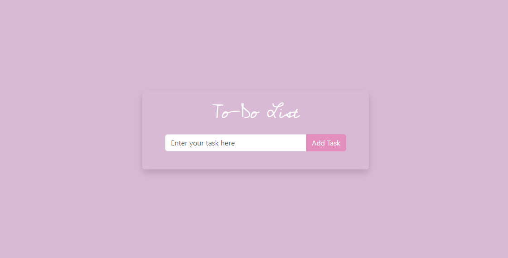
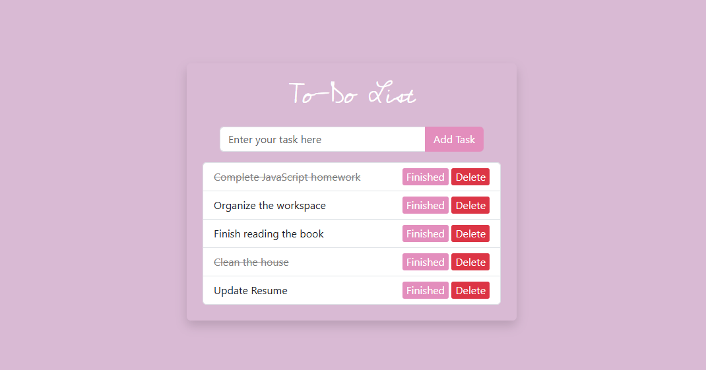

# ToDoList

This is a to-do list project, created with HTML, Bootstrap, and JavaScript. It allows the user to create, read, edit, and delete tasks, with data persistence in `localStorage`, so the information is saved even after reloading the page.

This is an exercise created for the FullStack Developer course by the +praTi and Codifica group.

## Screenshots

## Features

- Create Task: Add a new task by typing in the text field and clicking the "Add Task" button.
- Read Tasks: Saved tasks are automatically loaded when the page is opened.
- Edit Task: Each task has an edit option, allowing the text to be changed directly.
- Delete Task: Remove tasks from the list permanently.
- Mark as Completed: The "Complete" option visually distinguishes completed tasks.
- Data Persistence: All tasks are saved in localStorage and persist after closing or reloading the page.

## Technologies

- HTML5: Page structure.
- CSS with Bootstrap: Styling and responsiveness.
- JavaScript: Task list element manipulation and integration with localStorage.
